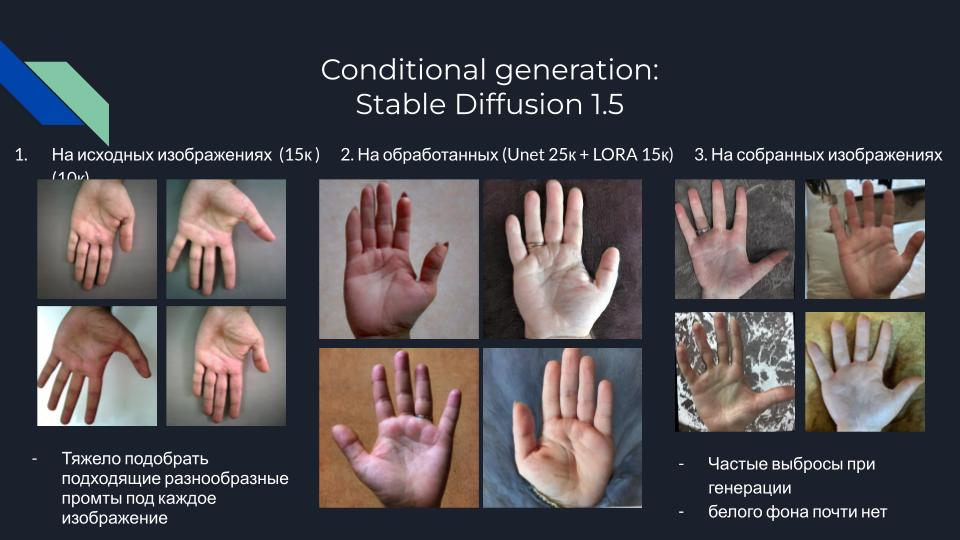
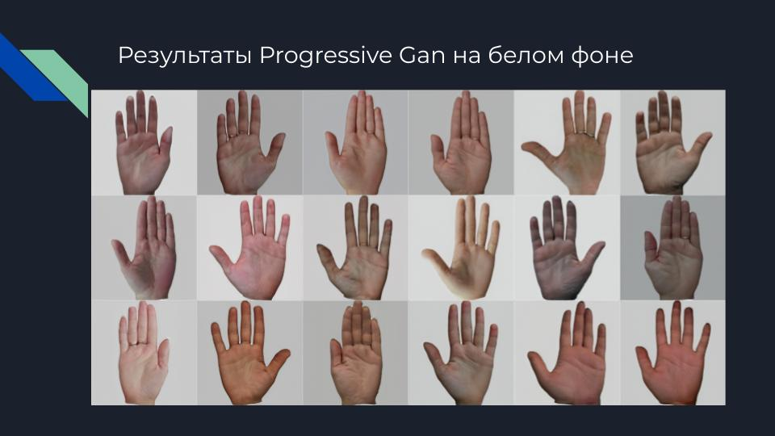
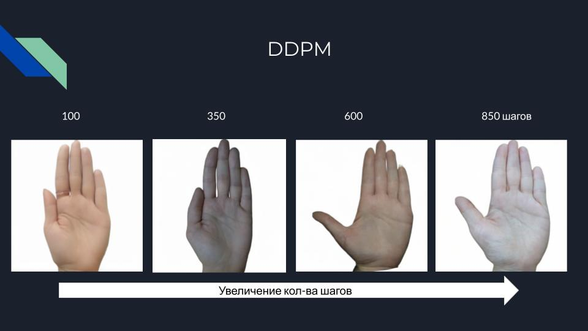

# Всероссийский хакатон по биометрии 2024
# Кейс: Создание инструмента для генерации синтетического датасета изображений ладоней
<a name="readme-top"></a>
<p align="center">  

</p>
  <p align="center">
    <!--<h1 align="center">Сборная 1</h1>-->
  </p>
  <p align="center">
    <p></p>
    <!-- <p><strong>Генерация ладоней.</strong></p> -->

  </p>
</div>

**Содержание:**
- [Проблематика задачи](#title1)
- [Описание решения](#title2)
- [Тестирование решения](#title3)

### Разработан в рамках [Всероссийский хакатон по биометрии 2024](https://biometricshack.ru/) командой "Сборная 1".

### Live версия доступна [тут](https://t.me/rosatom_support_bot)

## <h3 align="start"><a id="title1">Проблематика задачи</a></h3> 

### Описание кейса

Описание: разработать метод генерации изображений ладони, которые могут быть использованы для тренировки моделей аутентификации клиентов. Датасет должен обладать достаточной полнотой и разнообразием, необходимыми для обучения.
Для генерации датасета можно выбрать обученную open source модель или разработать собственную. Базу данных реальных изображений ладоней для дальнейшей работы нужно подготовить самостоятельно

Предусмотреть возможность управления генерацией задавая цвет кожи, наличие аксессуаров, шрамов и т.д.

#### Задачи
* инструмент, который позволяет генерировать синтетические изображения ладоней с пальцами
* возможность инструмента генерировать несколько разных изображений ладоней с пальцами,
принадлежащих одному синтетическому индивиду
* предложения по дальнейшему использованию и улучшению созданного синтетического датасета
для задач машинного обучения


### Датасет
<p align="center">  

</p>

* Открытый [датасет](https://biometricshack.ru/) (5397 подходящих изображений)
* Собранный датасет из открытых источников (7833 изображений)
* Отчищенный датасет с удаленным фоном и поворотом ладони перпендекулярно листу (7000 обучение, 700 тест)


## <h3 align="start"><a id="title2">Описание решения</a></h3>

### Контролируемая генерация

#### Stable Diffusion 1.5 

* Fine tune SD 1.5 Unet + Lora

<p align="center">  

</p>

* Контролируемая генерация по атрибутам

<p align="center">  

</p>

* Контролируемая генерация по одному целевому изображению (Dreambooth)

<p align="center">  

</p>

### Неконтролируемая генерация

#### ProGan

<p align="center">  

</p>

#### DDPM

<p align="center">  

</p>

### Метрики

<p align="center">  

</p>
 
### Структура проекта

```
├── src # основная пакет проекта для использования ddpm
│   ├── pipeline.py # базовый код для загрузки ddpm
├── train.py  # файл для обучения DDPM
├── gen.py # файл для генерации синтетичесских изображений с помощью DDPM (хороший белый фон)
├── notebooks # основная пакет проекта для использования ddpm
│   ├── ddpm_512.ipynb # инференс ddpm, обученной на белом фоне
│   ├── test.ipynb # препроцессинг изображений
├── SD # основная пакет проекта для использования ddpm
│   ├── dreambooth_train.ipynb # обучение контролируемой генерации похожих по одному целевому изображению
│   ├── train_text_to_image.ipynb # файнтюнинг SD 1.5 Unet + Lora
├── README.md # файл с инструкциями
├── requirements.txt # зависимости
```

## <h3 align="start"><a id="title3">Тестирование решения</a></h3> 

## Development

0. Install requirements

```
pip install -r requirements.txt
```

## Palm image generation images with unconditional latent diffusion and condition finetuned SD 1.5

original repository for train ddpm [repository](https://github.com/zyinghua/uncond-image-generation-ldm.git)

### Cloning to local
```bash
git clone https://github.com/Yagorka/ddpm_ema_512.git
```
Then call:
```bash
cd ddpm_ema_512
```
### Installing the dependencies
Before running the scripts, make sure to install the library's training dependencies:
```bash
pip install -r requirements.txt
```

### Unconditional generate images (good white background)
```bash
python gen.py dir_name number_image
```
dir_name - dir for save generated images

number_images - number images for generation

### Conditional generate images (good realistic background)
```bash
python gen_real_back.py dir_name number_image batch_size
```
dir_name - dir for save generated images

number_images - number images for generation

batch_size - batch size (default=4)


